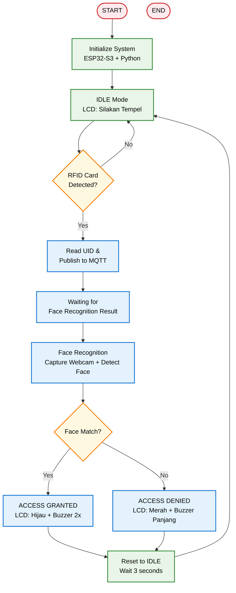
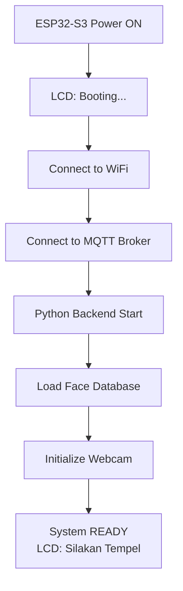

# 🔐 ESP32 RFID Face Recognition Access Control System

<h1 align="center">
🔐 RFID & Face Recognition Access Control<br>
    <sub>ESP32-S3 with RFID, Webcam Face Recognition, MQTT & LCD Display</sub>
</h1>

<p align="center">
  
  
  
  
  
  
  
  
</p>

---

## 📋 Daftar Isi
- [Mengapa Sistem Ini?](#-mengapa-sistem-ini)
- [Demo Singkat](#-demo-singkat)
- [Komponen Utama](#-komponen-utama-dan-fungsinya)
- [Software & Library](#-software--library)
- [Arsitektur Sistem](#-arsitektur-sistem)
- [Alur Kerja](#-alur-kerja-sistem)
- [Instalasi](#-instalasi)
- [Cara Menjalankan](#-cara-menjalankan)
- [Aplikasi Dunia Nyata](#-aplikasi-dunia-nyata)
- [Troubleshooting](#-troubleshooting)
- [Struktur Folder](#-struktur-folder)
- [Kontribusi](#-kontribusi)
- [Pengembang](#-pengembang)
- [Lisensi](#-lisensi)

---

## 🚀 Mengapa Sistem Ini?

### Keunggulan Sistem Access Control dengan RFID + Face Recognition

| Fitur | Sistem Konvensional | Sistem Ini | Keuntungan |
|-------|-------------------|-----------|-----------|
| **Autentikasi** | Hanya Kartu/PIN | Kartu + Face Recognition | 🔐 Double verification |
| **Keamanan** | Mudah dipalsukan | Wajah + Kartu = Aman | 🛡️ Anti-spoofing |
| **Monitoring** | Tidak ada | Real-time dengan preview | 📊 Audit trail |
| **Kontrol Akses** | Manual | Otomatis via MQTT | ⚡ Cepat & Akurat |
| **Biaya** | Mahal | Terjangkau | 💰 Cost-effective |
| **Integrasi** | Tertutup | Open source + MQTT | 🔗 Mudah dikembangkan |

### Keunggulan Sistem

✅ **Dual Authentication** - RFID card + Face Recognition  
✅ **Real-time Preview** - Tampilan webcam dengan bounding box  
✅ **MQTT Communication** - Komunikasi antar perangkat via broker public  
✅ **LCD Display** - Feedback visual di ESP32-S3  
✅ **LED & Buzzer** - Indikator akses diterima/ditolak  
✅ **Auto-Reset** - Sistem kembali ke IDLE setelah selesai  
✅ **Multiple Faces** - Support multiple images per orang  
✅ **Webcam Auto-Detect** - Deteksi Logitech C270 otomatis  
✅ **High FPS** - Webcam 30 FPS untuk recognition smooth  
✅ **Open Source** - Kode modular, mudah dimodifikasi  

---

## 📸 Demo Singkat — Sistem Access Control

<p align="center">
  <em>Sistem menampilkan preview webcam dengan bounding box, status akses, dan feedback di ESP32-S3 (LCD + LED + Buzzer)</em>
</p>

### 🔄 Alur Sistem

<p align="center">
  <strong>1. IDLE Mode:</strong> LCD menampilkan "Silakan Tempel"<br/>
  <strong>2. Kartu RFID:</strong> ESP32-S3 membaca UID, kirim ke MQTT<br/>
  <strong>3. Face Recognition:</strong> Python backend capture webcam, deteksi wajah<br/>
  <strong>4. Hasil:</strong> SUCCESS → LCD Hijau + Buzzer 2x / FAILED → LCD Merah + Buzzer panjang<br/>
  <strong>5. Kembali IDLE:</strong> Sistem siap untuk kartu berikutnya
</p>

### 📱 Tampilan Face Recognition

<p align="center">
  <br/>
  <em>Live preview webcam dengan bounding box, nama, status, FPS, dan timer</em>
</p>

---

## 🧩 Komponen Utama dan Fungsinya

### Hardware

| Komponen | Fungsi | Spesifikasi |
|----------|--------|-------------|
| **ESP32-S3-N16R8** | Otak utama sistem | Dual-core, WiFi, BLE, 16MB Flash |
| **RFID RC522** | Membaca kartu RFID | Frekuensi 13.56MHz, SPI |
| **LCD I2C 16x2** | Tampilan status akses | Alamat 0x27, I2C |
| **LED Merah** | Indikator akses ditolak | GPIO 16 |
| **LED Hijau** | Indikator akses diterima | GPIO 17 |
| **Buzzer** | Feedback suara | GPIO 18 |
| **Webcam Logitech C270** | Capture gambar untuk face recognition | USB, 30 FPS |

### Software

| Komponen | Fungsi |
|----------|--------|
| **Python Backend** | Face recognition, MQTT handler, webcam capture |
| **ESP32-S3 Firmware** | Baca RFID, kontrol LCD/LED/Buzzer, MQTT |
| **MQTT Broker** | Komunikasi ESP32-S3 ↔ Python |
| **OpenCV** | Capture & proses gambar dari webcam |
| **Face Recognition** | Deteksi & matching wajah |
| **PubSubClient** | MQTT client untuk ESP32 |

---

## 🔌 Wiring Diagram

### ESP32-S3 Connections

```
┌──────────────────────────────────────────────────────────────────────────┐
│                      ESP32-S3-N16R8                                      │
│                                                                          │
│  ┌───────────────────────────────────────────────────────────────────┐   │
│  │                         PIN CONNECTIONS                           │   │
│  ├───────────────────────────────────────────────────────────────────┤   │
│  │  GPIO 8  (SDA)      ←─── LCD I2C (SDA)                            │   │
│  │  GPIO 9  (SCL)      ←─── LCD I2C (SCL)                            │   │
│  │  GPIO 10 (SS)       ───► RFID RC522 (SDA)                         │   │
│  │  GPIO 11 (MOSI)     ───► RFID RC522 (MOSI)                        │   │
│  │  GPIO 12 (SCK)      ───► RFID RC522 (SCK)                         │   │
│  │  GPIO 13 (MISO)     ←─── RFID RC522 (MISO)                        │   │
│  │  GPIO 14 (RST)      ───► RFID RC522 (RST)                         │   │
│  │  GPIO 16            ───► LED Merah                                │   │
│  │  GPIO 17            ───► LED Hijau                                │   │
│  │  GPIO 18            ───► Buzzer                                   │   │
│  │  3.3V               ───► VCC LCD & RFID                           │   │
│  │  GND                ───► GND Semua Komponen                       │   │
│  └───────────────────────────────────────────────────────────────────┘   │
└──────────────────────────────────────────────────────────────────────────┘

┌──────────────────────────────────────────────────────────────────────────┐
│                         LCD I2C 16x2 (0x27)                              │
│  ┌───────────────────────────────────────────────────────────────────┐   │
│  │  VCC ───► 3.3V                                                    │   │
│  │  GND ───► GND                                                     │   │
│  │  SDA ───► GPIO 8                                                  │   │
│  │  SCL ───► GPIO 9                                                  │   │
│  └───────────────────────────────────────────────────────────────────┘   │
└──────────────────────────────────────────────────────────────────────────┘

┌──────────────────────────────────────────────────────────────────────────┐
│                         RFID RC522                                       │
│  ┌───────────────────────────────────────────────────────────────────┐   │
│  │  VCC ───► 3.3V                                                    │   │
│  │  GND ───► GND                                                     │   │
│  │  SDA ───► GPIO 10                                                 │   │
│  │  SCK ───► GPIO 12                                                 │   │
│  │  MOSI ──► GPIO 11                                                 │   │
│  │  MISO ──► GPIO 13                                                 │   │
│  │  RST ───► GPIO 14                                                 │   │
│  └───────────────────────────────────────────────────────────────────┘   │
└──────────────────────────────────────────────────────────────────────────┘
```

---

## 💻 Software & Library

### Pada ESP32-S3 (Firmware Arduino)

| Library | Fungsi |
|---------|--------|
| **WiFi.h** | Koneksi jaringan WiFi |
| **PubSubClient.h** | MQTT client untuk komunikasi |
| **MFRC522.h** | Driver RFID RC522 |
| **LiquidCrystal_I2C.h** | Driver LCD 16x2 I2C |
| **SPI.h** | Komunikasi SPI untuk RFID |

### Pada Python Backend

| Library | Fungsi |
|---------|--------|
| **OpenCV (cv2)** | Capture & proses gambar webcam |
| **face_recognition** | Face detection & recognition |
| **paho-mqtt** | MQTT client Python |
| **numpy** | Manipulasi array gambar |
| **Pillow** | Image processing |

### MQTT Topics

| Topic | Direction | Deskripsi |
|-------|-----------|-----------|
| `esp32/rfid/uid` | ESP32-S3 → Python | Kirim UID kartu RFID |
| `esp32/rfid/result` | Python → ESP32-S3 | Kirim hasil face recognition |
| `esp32/rfid/status` | Both | Status perangkat |

### Loop Non-Blocking Overview

- **ESP32-S3**: Loop dengan interval 50ms, MQTT reconnect otomatis
- **Python**: Thread-based recognition, non-blocking MQTT loop

---

## 🏗️ Arsitektur Sistem

### Diagram Blok Sistem

```
              ┌───────────────────────┐
              │   MQTT Broker         │
              │   (broker.emqx.io)    │
              └──────────┬────────────┘
                         │ MQTT
                         ▼
    ┌────────────────────┼────────────────────┐
    │                    │                    │
    ▼                    ▼                    ▼
┌─────────────┐  ┌─────────────┐  ┌─────────────────────┐
│  ESP32-S3   │  │   Python    │  │  Webcam Logitech    │
│  (RFID)     │  │   Backend   │  │  (Face Recognition) │
│─────────────│  │─────────────│  │─────────────────────│
│ - Baca RFID │  │ - MQTT      │  │ - Capture Frame     │
│ - LCD       │  │ - Face Rec  │  │ - 30 FPS            │
│ - LED       │  │ - Preview   │  │ - 640x480           │
│ - Buzzer    │  │ - Bounding  │  │                     │
└─────────────┘  └─────────────┘  └─────────────────────┘
       │                │                     │
       └────────────────┼─────────────────────┘
                        │
                        ▼
              ┌───────────────────────┐
              │  User Feedback        │
              │  - LCD Display        │
              │  - LED (Red/Green)    │
              │  - Buzzer Sound       │
              └───────────────────────┘
```

### Diagram Alur Data

```
┌─────────────────────────────────────────────────────────────────┐
│                     1. IDLE MODE                                │
│  ESP32-S3: LCD "Silakan Tempel" | LED OFF | Buzzer OFF          │
│  Python: Menunggu MQTT message                                  │
│  Webcam: Running (preview)                                      │
└─────────────────────────────────────────────────────────────────┘
                              │
                              ▼
┌─────────────────────────────────────────────────────────────────┐
│                  2. RFID CARD DETECTED                          │
│  ESP32-S3: Baca UID → publish ke MQTT "esp32/rfid/uid"         │
│  LCD: "Cek Wajah..." | LED kedip | Buzzer 1x                   │
└─────────────────────────────────────────────────────────────────┘
                              │
                              ▼
┌─────────────────────────────────────────────────────────────────┐
│                  3. FACE RECOGNITION                            │
│  Python: Terima UID → Capture webcam → Detect face             │
│  Preview: Bounding box + Nama + Status + FPS                   │
└─────────────────────────────────────────────────────────────────┘
                              │
              ┌───────────────┴───────────────┐
              ▼                               ▼
┌─────────────────────────┐   ┌─────────────────────────┐
│  4a. SUCCESS            │   │  4b. FAILED             │
│  Python → MQTT "SUCCESS"│   │  Python → MQTT "FAILED" │
│  ESP32-S3:              │   │  ESP32-S3:              │
│  LCD "Akses Diterima"   │   │  LCD "Akses Ditolak"    │
│  LED Hijau ON           │   │  LED Merah ON           │
│  Buzzer 2x pendek       │   │  Buzzer 1x panjang      │
└─────────────────────────┘   └─────────────────────────┘
              │                               │
              └───────────────┬───────────────┘
                              ▼
┌─────────────────────────────────────────────────────────────────┐
│                  5. KEMBALI KE IDLE                             │
│  ESP32-S3: LCD "Silakan Tempel" | LED OFF | Buzzer OFF          │
│  Python: Kembali menunggu MQTT message                          │
└─────────────────────────────────────────────────────────────────┘
```

### Flowchart Sistem



---

## 🔄 Alur Kerja Sistem

### 1. Inisialisasi Sistem



### 2. Pembacaan RFID (ESP32-S3)

```
Loop 50ms:
  1. Check MQTT connection
  2. Check RFID card
  3. If card detected:
     a. Read UID
     b. Publish to MQTT (esp32/rfid/uid)
     c. LCD: "Cek Wajah..."
     d. LED blink
     e. Buzzer 1x
     f. Wait for result (15s timeout)
  4. If result received:
     a. SUCCESS → LCD Hijau + Buzzer 2x
     b. FAILED → LCD Merah + Buzzer panjang
  5. After 3s → Reset to IDLE
```

### 3. Face Recognition (Python)

```
1. Receive UID from MQTT
2. Check UID in database
3. Start face recognition thread:
   a. Capture frame from webcam (30 FPS)
   b. Resize & convert to RGB
   c. Detect face locations & encodings
   d. Compare with known faces
   e. Draw bounding box + name + status
   f. Display preview window
   g. If match → SUCCESS
   h. If timeout/no face → FAILED
4. Publish result to MQTT (esp32/rfid/result)
5. Reset processing flag
```

### 4. Kalibrasi Face Database

```
Training face encodings:
  1. Scan known_faces/ directory
  2. Group by name (remove number suffix)
  3. For each image:
     a. Load image
     b. Detect face encoding
     c. Add to database
  4. Save to face_encodings.pkl
  5. Multiple images per person for better accuracy
```

---

## ⚙️ Instalasi

### 1. Clone Repository

```bash
git clone https://github.com/ficrammanifur/esp32-rfid-face-recognition.git
cd esp32-rfid-face-recognition
```

### 2. Setup ESP32-S3 (Arduino IDE)

#### Install ESP32 Board Package
1. Buka Arduino IDE
2. File → Preferences
3. Tambahkan URL di "Additional Boards Manager URLs":
   ```
   https://raw.githubusercontent.com/espressif/arduino-esp32/gh-pages/package_esp32_index.json
   ```
4. Tools → Board Manager → Cari "ESP32" → Install

#### Install Required Libraries
Buka Arduino IDE → Sketch → Include Library → Manage Libraries:
- **MFRC522** by Miguel Balboa
- **LiquidCrystal I2C** by Frank de Brabander
- **PubSubClient** by Nick O'Leary

#### Board Settings
```
Board: ESP32S3 Dev Module
USB CDC On Boot: Enabled
CPU Frequency: 240MHz
Flash Size: 16MB (128Mb)
PSRAM: OPI PSRAM
Partition Scheme: 16M Flash (3MB APP/9.9MB FATFS)
Upload Speed: 921600
```

### 3. Setup Python Environment

```bash
# Buat virtual environment
python3 -m venv venv
source venv/bin/activate  # Linux/Mac
# atau
venv\Scripts\activate     # Windows

# Install dependencies
pip install -r requirements.txt
```

**requirements.txt:**
```txt
opencv-python
face_recognition
numpy
paho-mqtt
pillow
```

### 4. Konfigurasi

#### Update `config.py`
```python
# WiFi
WIFI_SSID = "YOUR_WIFI_SSID"
WIFI_PASSWORD = "YOUR_WIFI_PASSWORD"

# MQTT
MQTT_BROKER = "broker.emqx.io"
MQTT_PORT = 1883
MQTT_TOPIC_RFID = "esp32/rfid/uid"
MQTT_TOPIC_RESULT = "esp32/rfid/result"

# Webcam
WEBCAM_INDEX = 1  # 1 = Logitech C270

# User Database (UID: Name)
USER_DATABASE = {
    "4BAA2206": "Rudi",
}
```

#### Update ESP32-S3 Firmware
```cpp
// WiFi
const char* WIFI_SSID = "YOUR_WIFI_SSID";
const char* WIFI_PASSWORD = "YOUR_WIFI_PASSWORD";

// MQTT
const char* MQTT_BROKER = "broker.emqx.io";
const int MQTT_PORT = 1883;
```

### 5. Tambahkan Gambar Wajah

```bash
mkdir -p known_faces
# Tambahkan gambar dengan format: nama.jpg, nama1.jpg, nama2.jpg
# Contoh: Rudi.jpg, Rudi1.jpg
```

### 6. Upload ke ESP32-S3
```
1. Hubungkan ESP32-S3 ke PC via USB
2. Tools → Board → ESP32S3 Dev Module
3. Tools → Port → Pilih port ESP32-S3
4. Sketch → Upload
5. Monitor Serial (Baud: 115200)
```

---

## 🚀 Cara Menjalankan

### 1. Persiapan Awal

```bash
# Pastikan ESP32-S3 terhubung via USB
# Pastikan webcam Logitech C270 terhubung
# Pastikan WiFi router aktif
# Pastikan MQTT broker dapat diakses
```

### 2. Jalankan Python Backend

```bash
cd project-test
source venv/bin/activate
python main.py
```

### 3. Monitor Output

#### Python Terminal akan menampilkan:
```
============================================================
🏢 ESP32 RFID & Face Recognition System
============================================================

📋 KONFIGURASI:
   Laptop IP: 192.168.1.50
   ESP32-S3 IP: 192.168.1.10
   MQTT Broker: broker.emqx.io:1883
   Webcam Index: 1
   Users: Rudi
============================================================

📸 Loading face database...
✅ Loaded 2 face encodings
📋 People: Rudi

📡 Initializing MQTT...
✅ Connected to MQTT Broker!

📷 Initializing webcam...
✅ Webcam connected!
   Resolution: 640x480
   FPS: 30.0

============================================================
✅ SYSTEM READY!
💡 Tempelkan kartu RFID ke ESP32-S3
📷 Lihat ke webcam!
============================================================
```

#### ESP32-S3 Serial Monitor:
```
========================================
🏢 ESP32-S3 RFID Access Control
========================================

📡 Inisialisasi MQTT...
✅ SYSTEM READY!
💡 Tempelkan kartu RFID untuk memulai

🔑 Kartu RFID Terdeteksi!
   UID: 4BAA2206
📤 UID terkirim ke MQTT

📨 Pesan MQTT Diterima:
   Topic: esp32/rfid/result
   Payload: {"status":"SUCCESS","name":"Rudi"}

✅ AKSES DITERIMA!
   Selamat datang: Rudi
```

### 4. Face Recognition Preview Window

Window akan menampilkan:
- Live video dari webcam
- Bounding box di sekitar wajah
- Nama orang yang dikenali
- Status (SUCCESS/FAILED/PROCESSING)
- FPS counter
- Timer countdown

### 5. Feedback ESP32-S3

| Status | LCD | LED | Buzzer |
|--------|-----|-----|--------|
| **IDLE** | "Silakan Tempel" | OFF | OFF |
| **Processing** | "Cek Wajah..." | Green blink | 1x beep |
| **SUCCESS** | "Akses Diterima" | Green ON | 2x short beep |
| **FAILED** | "Akses Ditolak" | Red ON | 1x long beep |
| **Timeout** | "Timeout!" | OFF | OFF |

---

## 🌍 Aplikasi Dunia Nyata

### 🏢 1️⃣ Kantor / Gedung Perkantoran

**Masalah:** Akses ruangan dengan kartu saja kurang aman.  
**🤖 Solusi:** Kartu RFID + Face Recognition untuk double verification.  
**Teknologi:** MQTT untuk integrasi dengan sistem lain.

### 🏠 2️⃣ Smart Home / Rumah Pintar

**Masalah:** Keamanan rumah dengan kunci konvensional rentan.  
**🤖 Solusi:** Sistem akses pintu dengan RFID + Face Recognition.  
**Nilai Tambah:** Bisa diintegrasikan dengan smart lock.

### 🏫 3️⃣ Sekolah / Universitas

**Masalah:** Absensi manual tidak efisien dan rawan kecurangan.  
**🤖 Solusi:** Absensi otomatis dengan RFID + Face Recognition.  
**Teknologi:** Database terintegrasi untuk rekapitulasi.

### 🏭 4️⃣ Pabrik / Gudang

**Masalah:** Monitoring akses area terbatas sulit dilakukan.  
**🤖 Solusi:** Sistem akses dengan autentikasi ganda.  
**Teknologi:** Multi-ESP32 untuk banyak pintu.

---

## 🐞 Troubleshooting

### Webcam Tidak Terdeteksi

**Gejala:** Error "Failed to open webcam" di Python.  
**Solusi:**
```bash
# Cek webcam yang terhubung
ls -la /dev/video*
lsusb | grep Logitech

# Test webcam
python test_webcam.py

# Ganti WEBCAM_INDEX di config.py
WEBCAM_INDEX = 1  # Coba 0, 1, 2
```

### RFID Tidak Terbaca

**Gejala:** ESP32-S3 tidak mendeteksi kartu.  
**Solusi:**
```
1. Periksa wiring RFID RC522
2. Pastikan pin SPI benar
3. Cek power 3.3V
4. Test dengan sketch RFID sederhana
```

### MQTT Gagal Connect

**Gejala:** "Failed to connect to MQTT" di ESP32-S3.  
**Solusi:**
```
1. Cek WiFi connection
2. Cek MQTT broker (broker.emqx.io)
3. Cek internet connection
4. Test dengan mosquitto_sub
```

### Face Recognition Tidak Akurat

**Gejala:** Wajah tidak terdeteksi atau salah match.  
**Solusi:**
```
1. Tambah lebih banyak gambar training
2. Pastikan pencahayaan cukup
3. Jarak webcam 30-80cm
4. Hapus face_encodings.pkl dan training ulang
```

### LCD Tidak Menampilkan Teks

**Gejala:** Layar kosong atau kotak-kotak.  
**Solusi:**
```
1. Cek alamat I2C (0x27 atau 0x3F)
2. Putar potensiometer kontras
3. Periksa koneksi SDA/SCL
4. Cek power LCD (3.3V/5V)
```

### Face Recognition Preview Window Tidak Muncul

**Gejala:** Tidak ada window setelah RFID terbaca.  
**Solusi:**
```
1. Pastikan webcam berfungsi
2. Install GUI dependencies:
   sudo apt-get install python3-tk
3. Cek DISPLAY environment variable
```

---

## 📁 Struktur Folder

```
esp32-rfid-face-recognition/
├── 📄 README.md                    # Dokumentasi proyek
├── 📄 LICENSE                      # MIT License
├── 📄 requirements.txt             # Python dependencies
├── 🤖 esp32s3_firmware/
│   └── esp32_s3_rfid_mqtt.ino     # Firmware ESP32-S3
├── 🐍 python_backend/
│   ├── main.py                    # Backend utama
│   └── config.py                  # Konfigurasi
├── 📁 known_faces/                # Training images
│   ├── Rudi.jpg
│   ├── Rudi1.jpg
│   └── Fris.jpg
├── 📁 assets/                     # Gambar & diagram
│   ├── wiring_diagram.png
│   ├── flowchart.png
│   └── preview.png
└── 📁 test/                       # Modul pengujian
    ├── test_webcam.py             # Test webcam
    └── test_mqtt.py               # Test MQTT
```

---

## 🤝 Kontribusi

Kontribusi sangat diterima! Mari kembangkan sistem access control ini bersama.

### Cara Berkontribusi
1. **Fork** repository ini
2. **Create** feature branch (`git checkout -b feature/NewFeature`)
3. **Commit** changes (`git commit -m 'Add NewFeature'`)
4. **Push** to branch (`git push origin feature/NewFeature`)
5. **Open** Pull Request

### Area Pengembangan
- [ ] Tambah fingerprint sensor
- [ ] Web dashboard monitoring
- [ ] Database SQLite untuk log akses
- [ ] Telegram/WhatsApp notification
- [ ] Multi-ESP32-S3 untuk banyak pintu
- [ ] LED strip untuk visual feedback
- [ ] Voice greeting with speaker
- [ ] Email notification for failed attempts
- [ ] Time-based access control
- [ ] OTA update untuk ESP32-S3
- [ ] Mobile app untuk monitoring

---

## 👨‍💻 Pengembang

**Ficram Manifur**
- 🐙 GitHub: [@ficrammanifur](https://github.com/ficrammanifur)
- 🌐 Portfolio: [ficrammanifur.github.io](https://ficrammanifur.github.io/ficram-portfolio)
- 📧 Email: ficramm@gmail.com

### 🙏 Acknowledgments
- **MQTT Team** - Protocol komunikasi yang handal
- **OpenCV Team** - Library computer vision
- **face_recognition** - Face detection & recognition
- **Arduino Community** - Library & dukungan

---

## 📄 Lisensi

Proyek ini dilisensikan di bawah **MIT License** - lihat file [LICENSE](LICENSE) untuk detail lengkap.

```text
MIT License

Copyright (c) 2025 ficrammanifur

Permission is hereby granted, free of charge, to any person obtaining a copy
of this software and associated documentation files (the "Software"), to deal
in the Software without restriction, including without limitation the rights
to use, copy, modify, merge, publish, distribute, sublicense, and/or sell
copies of the Software, and to permit persons to whom the Software is
furnished to do so, subject to the following conditions:

The above copyright notice and this permission notice shall be included in all
copies or substantial portions of the Software.

THE SOFTWARE IS PROVIDED "AS IS", WITHOUT WARRANTY OF ANY KIND, EXPRESS OR
IMPLIED, INCLUDING BUT NOT LIMITED TO THE WARRANTIES OF MERCHANTABILITY,
FITNESS FOR A PARTICULAR PURPOSE AND NONINFRINGEMENT. IN NO EVENT SHALL THE
AUTHORS OR COPYRIGHT HOLDERS BE LIABLE FOR ANY CLAIM, DAMAGES OR OTHER
LIABILITY, WHETHER IN AN ACTION OF CONTRACT, TORT OR OTHERWISE, ARISING FROM,
OUT OF OR IN CONNECTION WITH THE SOFTWARE OR THE USE OR OTHER DEALINGS IN THE
SOFTWARE.
```

---

<div align="center">

**🔐 RFID & Face Recognition Access Control System**

**⚡ Built with ESP32-S3, Python, OpenCV, and MQTT**

**⭐ Star this repo if you like it!**

<p><a href="#top">⬆ Back on Top</a></p>
</div>
